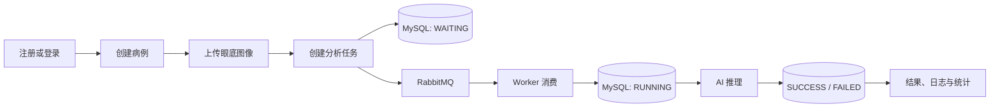

# RetinaVision Backend

RetinaVision 是一个面向眼底图像 AI 批量分析与报告管理场景的后端服务。项目提供用户鉴权、病例管理、图像上传、异步分析任务、任务状态流转、分析结果、任务日志和统计看板等 API，并通过 RabbitMQ 解耦任务提交与 Worker 消费。

本仓库是 RetinaVision 的后端工程，默认 API 基础地址为：

```text
http://localhost:8080/api
```

## 当前能力

- JWT 注册、登录、当前用户和退出接口
- 病例分页、筛选、创建、详情、更新和软删除
- 眼底图像上传、列表、预览和软删除
- 分析任务创建、分页、详情、取消和失败重试
- RabbitMQ 任务投递、手动 ACK/NACK 和死信队列
- Python FSCNet 血管分割服务调用与结果图回收
- `VESSEL_SEGMENTATION` 自动推进到 `SUCCESS` 或 `FAILED`
- 任务状态日志与详情时间线数据
- 分析结果查询、结果图预览和报告下载
- 任务数量、处理耗时、趋势和队列统计
- 统一响应结构、分页结构、错误码与全局异常处理

> 当前真实 AI 链路仅支持 `VESSEL_SEGMENTATION`。`IMAGE_QUALITY_CHECK` 会明确进入 `FAILED`，不会返回伪造结果。

## 技术栈

| 分类 | 技术 |
|---|---|
| 运行环境 | Java 17 |
| Web 框架 | Spring Boot 3.5.14、Spring Web |
| 安全认证 | Spring Security、JWT、BCrypt |
| 数据访问 | MyBatis-Plus 3.5.14、MySQL 8.4 |
| 消息队列 | RabbitMQ 3 Management、Spring AMQP |
| 文件存储 | 本地文件系统；MinIO 依赖已预留 |
| 其他依赖 | Redis 依赖已预留、Lombok、Jackson |
| 测试 | JUnit 5、Mockito、Spring Boot Test |

## 业务流程



## 项目结构

```text
RetinaVision/
├─ docker/
│  ├─ docker-compose.yml       # MySQL 与 RabbitMQ 开发环境
│  └─ mysql/init.sql           # 数据库初始化脚本
├─ src/
│  ├─ main/
│  │  ├─ java/com/example/retinavision/
│  │  │  ├─ config/            # Security、RabbitMQ 配置
│  │  │  ├─ constant/          # 错误码和错误文案
│  │  │  ├─ controller/        # HTTP 接口
│  │  │  ├─ enumeration/       # 业务枚举
│  │  │  ├─ exception/         # 业务异常和全局异常处理
│  │  │  ├─ filter/            # JWT 认证过滤器
│  │  │  ├─ mapper/            # MyBatis Mapper
│  │  │  ├─ mq/                # RabbitMQ 消息、发布者和消费者
│  │  │  ├─ pojo/              # DTO、Entity、VO
│  │  │  ├─ result/            # 统一响应和分页响应
│  │  │  ├─ service/           # 业务服务
│  │  │  └─ utils/             # JWT 等工具
│  │  └─ resources/
│  │     ├─ mapper/            # MyBatis XML
│  │     ├─ application.yaml
│  │     └─ application-dev.yaml
│  └─ test/                    # 后端测试
├─ uploads/                    # 本地上传文件，已被 Git 忽略
└─ pom.xml
```

## 环境要求

- JDK 17
- Maven 3.9+
- Docker Desktop 与 Docker Compose（推荐）
- MySQL 8.x
- RabbitMQ 3.x
- Python 3.11 与独立的 `retinavision-ai` 推理服务

可检查本机环境：

```powershell
java -version
mvn.cmd -version
docker version
docker compose version
```

Linux 或 macOS 请将后续命令中的 `mvn.cmd` 替换为 `mvn`。

## 本地启动

### 1. 克隆并进入后端目录

```bash
git clone <repository-url>
cd RetinaVision
```

### 2. 启动 MySQL 和 RabbitMQ

```powershell
docker compose -f docker/docker-compose.yml up -d
```

默认开发服务：

| 服务 | 地址或端口 | 开发账号 |
|---|---|---|
| MySQL | `localhost:3307` | `retina / retina123456` |
| RabbitMQ AMQP | `localhost:5672` | `retina / retina123456` |
| RabbitMQ 管理界面 | <http://localhost:15672> | `retina / retina123456` |

数据库首次创建时会执行 `docker/mysql/init.sql`，初始化以下表：

```text
sys_user
medical_case
image_file
analysis_task
analysis_result
task_log
```

> `init.sql` 使用 `CREATE TABLE IF NOT EXISTS`，只负责空库初始化，不会自动升级已经存在的旧表。修改表结构后，请编写迁移 SQL，或在确认数据可删除后重新创建开发数据卷。

查看基础设施状态：

```powershell
docker compose -f docker/docker-compose.yml ps
```

### 3. 创建开发配置

`src/main/resources/application-dev.yaml` 包含本机数据库和 RabbitMQ 连接信息，并已通过 `.gitignore` 排除。首次克隆后需要自行创建：

```yaml
spring:
  datasource:
    driver-class-name: com.mysql.cj.jdbc.Driver
    url: jdbc:mysql://localhost:3307/retina_vision?useUnicode=true&characterEncoding=utf8&serverTimezone=Asia/Shanghai&useSSL=false&allowPublicKeyRetrieval=true
    username: retina
    password: retina123456

  rabbitmq:
    host: localhost
    port: 5672
    username: retina
    password: retina123456
    virtual-host: /
    publisher-confirm-type: correlated
    publisher-returns: true
    template:
      mandatory: true
    listener:
      simple:
        acknowledge-mode: manual

retina:
  upload:
    result-root: uploads/results
  mq:
    analysis-exchange: retina.analysis.exchange
    analysis-routing-key: retina.analysis.task.created
    analysis-queue: retina.analysis.task.queue
    analysis-dead-letter-exchange: retina.analysis.dlx
    analysis-dead-letter-routing-key: retina.analysis.task.dead
    analysis-dead-letter-queue: retina.analysis.task.dead.queue
```

基础配置位于 `application.yaml`：

```yaml
server:
  port: 8080
  servlet:
    context-path: /api
```

开发环境默认启用 `dev` Profile。

### 4. 启动 Python AI 服务

在 `C:\codexcode\RetinaVision\retinavision-ai` 中执行：

```powershell
& 'C:\develop\anaconda3\envs\retinavision-ai\python.exe' -m uvicorn retinavision_ai.api:app --app-dir src --host 127.0.0.1 --port 8000
```

确认模型已加载：

```powershell
Invoke-RestMethod http://127.0.0.1:8000/health
```

后端默认通过以下配置访问 AI 服务：

```yaml
retina:
  ai:
    base-url: http://127.0.0.1:8000
    connect-timeout: 5s
    read-timeout: 5m
```

### 5. 启动后端

```powershell
mvn.cmd spring-boot:run
```

服务启动后访问：

```text
http://localhost:8080/api
```

### 6. 运行测试与构建

```powershell
mvn.cmd test
mvn.cmd clean package
```

跳过测试构建：

```powershell
mvn.cmd clean package -DskipTests
```

构建产物位于 `target/`。

## API 概览

除注册和登录外，其余接口需要请求头：

```http
Authorization: Bearer <token>
```

### 认证

| 方法 | 路径 | 说明 |
|---|---|---|
| POST | `/api/auth/register` | 注册用户 |
| POST | `/api/auth/login` | 登录并获取 Token |
| GET | `/api/auth/me` | 获取当前用户 |
| POST | `/api/auth/logout` | 退出登录 |

### 病例

| 方法 | 路径 | 说明 |
|---|---|---|
| GET | `/api/cases` | 分页查询病例 |
| POST | `/api/cases` | 创建病例 |
| GET | `/api/cases/{caseId}` | 查询病例详情 |
| PUT | `/api/cases/{caseId}` | 更新病例 |
| DELETE | `/api/cases/{caseId}` | 软删除病例 |

### 图像

| 方法 | 路径 | 说明 |
|---|---|---|
| GET | `/api/cases/{caseId}/images` | 查询病例图像 |
| POST | `/api/cases/{caseId}/images` | 上传图像，表单字段为 `file` |
| GET | `/api/images/{imageId}/preview` | 预览图像 |
| DELETE | `/api/images/{imageId}` | 软删除图像 |

### 分析任务与日志

| 方法 | 路径 | 说明 |
|---|---|---|
| GET | `/api/analysis-tasks` | 分页查询任务 |
| POST | `/api/analysis-tasks` | 创建任务 |
| GET | `/api/analysis-tasks/{taskId}` | 查询任务详情 |
| POST | `/api/analysis-tasks/{taskId}/cancel` | 取消任务 |
| POST | `/api/analysis-tasks/{taskId}/retry` | 重试失败任务 |
| GET | `/api/analysis-tasks/{taskId}/logs` | 查询任务日志 |

### 分析结果

| 方法 | 路径 | 说明 |
|---|---|---|
| GET | `/api/analysis-tasks/{taskId}/result` | 查询任务结果 |
| GET | `/api/results/{resultId}/mask` | 预览结果图 |
| GET | `/api/results/{resultId}/report` | 下载分析报告 |

### Dashboard

| 方法 | 路径 | 说明 |
|---|---|---|
| GET | `/api/admin/statistics/tasks` | 查询任务统计 |
| GET | `/api/admin/statistics/queue` | 查询 RabbitMQ 队列统计 |
| GET | `/api/admin/statistics/task-trend?days=7` | 查询任务趋势 |

详细请求字段、响应字段、枚举和错误码请查看前后端共同维护的 `API_CONTRACT.md`。

## 统一响应

普通接口返回：

```json
{
  "code": 0,
  "message": "success",
  "data": {}
}
```

分页数据位于 `data`：

```json
{
  "pageNo": 1,
  "pageSize": 10,
  "total": 1,
  "records": []
}
```

常用错误码：

| 错误码 | 含义 |
|---|---|
| `0` | 成功 |
| `40000` | 参数错误 |
| `40001` | 登录错误 |
| `40100` | 未登录或 Token 失效 |
| `40300` | 无权限 |
| `40400` | 资源不存在 |
| `40900` | 状态冲突或重复提交 |
| `50000` | 服务端内部错误 |
| `50001` | 文件存储异常 |
| `50002` | MQ 投递异常 |
| `50003` | AI 任务执行异常 |

## 任务与 RabbitMQ

任务主要状态：

```text
CREATED
WAITING
RUNNING
SUCCESS
FAILED
CANCELED
RETRYING
```

当前基础流转：

```text
创建任务 -> WAITING -> RabbitMQ -> RUNNING -> Python AI -> SUCCESS
Python AI 调用或推理失败 -> FAILED -> 重试 -> WAITING
CREATED/WAITING -> CANCELED
```

队列名称：

```text
主交换机: retina.analysis.exchange
主队列:   retina.analysis.task.queue
死信交换机: retina.analysis.dlx
死信队列:   retina.analysis.task.dead.queue
```

消费者使用手动确认：

- 处理成功后执行 ACK。
- 无效或重复消息根据任务状态安全 ACK。
- 消费异常且不可重新入队时执行 NACK，消息进入死信队列。

## 文件存储

当前使用本地文件系统：

```text
uploads/images/cases/{caseId}/{uuid}.{ext}
uploads/results/
```

支持上传格式：

```text
png
jpg / jpeg
tif / tiff
```

单文件上限为 20 MB。`uploads/` 已加入 `.gitignore`，不会推送到仓库。

## 前端联调

前端开发环境通常通过 Vite 将 `/api` 转发到：

```text
http://127.0.0.1:8080
```

推荐联调顺序：

```text
注册
-> 登录
-> 创建病例
-> 上传图像
-> 创建任务
-> 查看任务列表和详情
-> 查看任务日志
-> 查看分析结果
-> 查看 Dashboard
```

## 常见问题

### 启动时报数据库连接失败

确认 MySQL 容器已启动，并检查：

```powershell
docker compose -f docker/docker-compose.yml ps
docker logs retina_mysql
```

同时确认 `application-dev.yaml` 使用端口 `3307`。

### RabbitMQ 连接失败

确认 `retina_rabbitmq` 正常运行，并访问 <http://localhost:15672> 检查队列和消费者。

### 修改 init.sql 后数据库结构没有变化

初始化脚本只在 MySQL 数据目录首次创建时执行，而且 `CREATE TABLE IF NOT EXISTS` 不会升级旧表。请使用迁移 SQL；仅在确认开发数据可删除时，才执行：

```powershell
docker compose -f docker/docker-compose.yml down -v
docker compose -f docker/docker-compose.yml up -d
```

`down -v` 会永久删除当前 Docker 数据卷中的数据库和 RabbitMQ 数据，请谨慎使用。

### 任务进入 FAILED，提示 AI 服务调用失败

确认 Python 服务已启动，并检查 <http://127.0.0.1:8000/health>。后端会将原图上传到 Python 服务，下载 mask 后保存到 `uploads/results/tasks/{taskId}/mask.png`。

### Dashboard 队列未确认消息始终为 0

AMQP 被动声明无法提供精确的 unacked 数量，当前该字段返回 `0`。需要接入 RabbitMQ Management HTTP API 才能获得准确值。

## 安全说明

- `docker-compose.yml` 中的账号密码仅供本地开发使用。
- 部署到共享或生产环境前，必须替换 MySQL、RabbitMQ 和 JWT 密钥。
- 不要提交 `application-dev.yaml`、真实 Token、患者图像或分析结果。
- 不要在日志或异常信息中打印密码、JWT 或敏感请求头。
- 生产环境应通过环境变量或密钥管理服务注入敏感配置。

## 当前限制与后续工作

- 为 `IMAGE_QUALITY_CHECK` 接入独立模型；当前仅支持血管分割。
- 补齐病例和图像删除前的任务关联校验。
- 增加 RabbitMQ、结果文件、统计 SQL 和完整接口集成测试。
- 统一部分 Java ID 字段的 `Integer`/`Long` 类型。
- 引入 Flyway 或 Liquibase 管理数据库升级。
- 根据部署需求正式接入 MinIO 和 Redis。

## License

当前仓库暂未声明开源许可证。未经项目所有者授权，请勿公开分发或用于生产环境。
